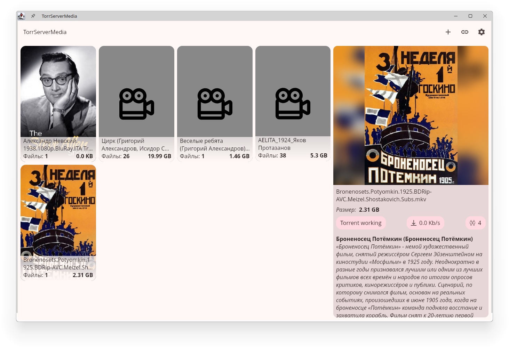
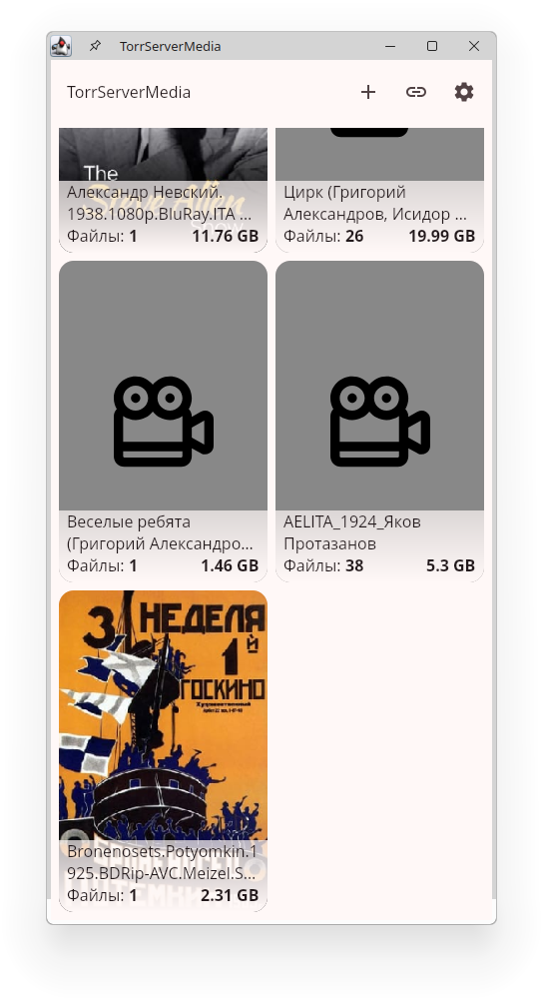
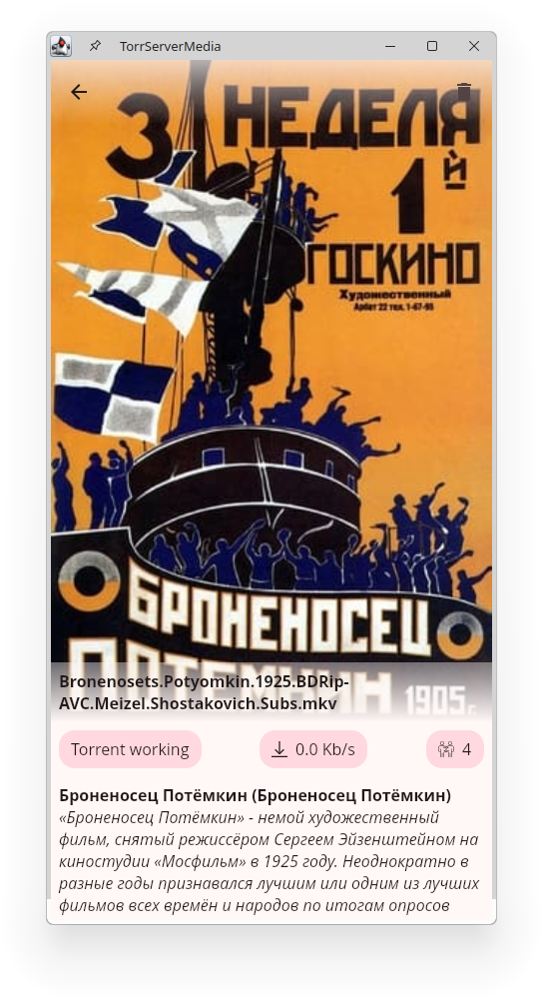

# 🎬 TorrServerMedia

**TorrServerMedia** is a cross-platform application for working with [TorrServer](https://github.com/YouROK/TorrServer), allowing you to easily stream media via torrent links.
The project also integrates with [The Movie Database API](https://www.themoviedb.org/) to provide rich media information — movie posters, descriptions, and ratings.
---

## 🚀 **Project Features**

- 📌 Supports Android, Windows, Linux
- 📌 Intuitive user interface
- 📌 Direct integration with TorrServer
- 📌 Supports external players for media playback

---

## 🛠 **Technologies and Libraries**

The project is built with **Kotlin Multiplatform (KMP)** using modern tools:

### 🎯 Core Stack:

- [**Kotlin Multiplatform**](https://github.com/JetBrains/kotlin) — shared code for Android and Desktop (Windows, Linux)
- [**Jetpack Compose**](https://github.com/JetBrains/compose-multiplatform) — declarative UI for Android and Desktop
- [**Ktor**](https://github.com/ktorio/ktor) — for network requests
- [**Coroutines**](https://github.com/Kotlin/kotlinx.coroutines) — for asynchronous and multithreading support
- [**Decompose**](https://github.com/arkivanov/Decompose) — a Kotlin Multiplatform library for breaking down your code into tree-structured, lifecycle-aware business logic components (aka BLoC), with routing functionality and pluggable UI (Jetpack/Multiplatform Compose, Android Views, SwiftUI, Kotlin/React, etc.)
- [**TorrServer**](https://github.com/YouROK/TorrServer) — a simple and powerful tool for streaming torrents.

---

## 🛠️ **Setup and Run**

### 🔧 **Prerequisites**

1. **Install JDK 17 or later**
2. **Set up Android Studio**
3. **Add `local.properties` with the path to Android SDK**

## 🖥️ Screens

### ▶️ **Running the project**

#### **Android**
To run the application on android device/emulator:
- open project in Android Studio and run imported android run configuration

To build the application bundle:
- run `./gradlew :composeApp:assembleDebug`
- find `.apk file in composeApp/build/outputs/apk/debug/composeApp-debug.apk`

#### **Desktop**
- Run the desktop application: `./gradlew :composeApp:run`
- Run desktop UI tests: `./gradlew :composeApp:jvmTest`
- Compile Jar: `./gradlew packageUberJarForCurrentOS`
- Compile AppImage: `./gradlew packageAppImage`
- Compile EXE: `./gradlew packageExe`